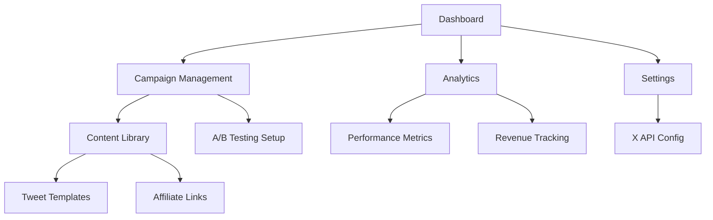

# X Affiliate Marketing Automation Platform - Product Requirements Document

## 1. Product Overview
An automated social media marketing platform for X (Twitter) that enables affiliate marketers to schedule, post, and track performance of adult content promotions across multiple NSFW niches. The platform focuses on maximizing affiliate revenue through intelligent automation, A/B testing, and comprehensive analytics while maintaining compliance with X's content policies.

## 2. Core Features

### 2.1 User Roles
| Role | Registration Method | Core Permissions |
|------|---------------------|------------------|
| Admin User | Direct system access | Full system configuration, analytics access, campaign management |
| Content Manager | Admin invitation | Create/edit campaigns, manage tweet content, view performance metrics |

### 2.2 Feature Module
Our X affiliate marketing automation platform consists of the following main pages:
1. **Dashboard**: Campaign overview, performance metrics, quick actions panel
2. **Campaign Management**: Create/edit campaigns, niche selection, content scheduling
3. **Content Library**: Tweet templates, affiliate link management, media assets
4. **Analytics**: Performance tracking, A/B test results, revenue analytics
5. **Settings**: X API configuration, automation rules, notification preferences

### 2.3 Page Details
| Page Name | Module Name | Feature description |
|-----------|-------------|---------------------|
| Dashboard | Campaign Overview | Display active campaigns, today's posting schedule, key performance indicators |
| Dashboard | Performance Metrics | Show click-through rates, engagement metrics, revenue tracking with UTM parameters |
| Dashboard | Quick Actions | Start/stop campaigns, emergency pause, manual tweet posting |
| Campaign Management | Campaign Creator | Set up new campaigns with niche selection (MILF/Breeding/Creampie, Teen, Trans/Femboy/Gay/Bisexual) |
| Campaign Management | Scheduling Engine | Configure posting frequency, optimal timing, content rotation rules |
| Campaign Management | A/B Testing Setup | Create tweet variations, define test parameters, set success metrics |
| Content Library | Tweet Templates | Pre-written tweet templates for each niche with placeholder affiliate links |
| Content Library | Affiliate Link Manager | Store and organize affiliate URLs, apply UTM tracking parameters |
| Content Library | Media Assets | Upload and manage images/videos for tweet attachments |
| Analytics | Performance Dashboard | Track impressions, clicks, conversions, revenue by campaign and niche |
| Analytics | A/B Test Results | Compare performance of tweet variations, identify winning content |
| Analytics | Revenue Tracking | Monitor affiliate commissions, calculate ROI, generate financial reports |
| Settings | X API Configuration | Manage X API credentials, authentication tokens, rate limiting |
| Settings | Automation Rules | Set posting schedules, content rotation, safety limits |
| Settings | Notifications | Configure alerts for campaign performance, API issues, compliance warnings |

## 3. Core Process

**Admin User Flow:**
1. Configure X API credentials and authentication
2. Set up affiliate links with UTM tracking parameters
3. Create campaigns for target niches (MILF/Breeding/Creampie, Teen, Trans/Femboy/Gay/Bisexual)
4. Upload tweet templates and media assets
5. Configure automated posting schedules and A/B testing parameters
6. Monitor performance through analytics dashboard
7. Optimize campaigns based on performance data

**Content Manager Flow:**
1. Access campaign management interface
2. Create new tweet content using templates
3. Schedule posts for optimal engagement times
4. Monitor real-time performance metrics
5. Adjust content strategy based on analytics

## 4. User Interface Design

### 4.1 Design Style
- **Primary Colors**: Dark theme with purple (#8B5CF6) and pink (#EC4899) accents for adult content branding
- **Secondary Colors**: Dark gray (#1F2937) background, white (#FFFFFF) text, red (#EF4444) for alerts
- **Button Style**: Rounded corners (8px), gradient backgrounds, hover animations
- **Font**: Inter font family, 14px base size, 16px for headings
- **Layout Style**: Card-based design with sidebar navigation, responsive grid system
- **Icons**: Feather icons for consistency, custom adult-themed icons where appropriate

### 4.2 Page Design Overview
| Page Name | Module Name | UI Elements |
|-----------|-------------|-------------|
| Dashboard | Campaign Overview | Grid layout with metric cards, purple gradient backgrounds, real-time updating counters |
| Dashboard | Performance Chart | Line charts with pink/purple gradients, interactive tooltips, time range selectors |
| Campaign Management | Campaign Form | Multi-step wizard with dark cards, niche selection with visual icons, purple CTAs |
| Content Library | Tweet Editor | Rich text editor with character counter, media upload dropzone, preview panel |
| Analytics | Performance Tables | Sortable data tables with dark theme, color-coded performance indicators |
| Settings | Configuration Forms | Tabbed interface with form validation, secure input fields for API keys |

### 4.3 Responsiveness
Desktop-first design with mobile-adaptive breakpoints at 768px and 1024px. Touch-optimized interactions for mobile campaign monitoring and emergency controls.

## 5. Technical Requirements

### 5.1 Core Technologies
- **Backend**: Python Flask framework with Tweepy for X API integration
- **Scheduling**: Python `schedule` library for automated posting
- **Database**: SQLite for MVP, PostgreSQL for production scaling
- **Containerization**: Docker for deployment consistency
- **Authentication**: X OAuth 2.0 for API access

### 5.2 Integration Requirements
- X API v2 for tweet posting and analytics
- UTM parameter generation for affiliate link tracking
- Webhook support for real-time performance updates
- Rate limiting compliance with X API restrictions

### 5.3 Security & Compliance
- Secure storage of X API credentials
- Content labeling for NSFW material
- Compliance with X's adult content policies
- Affiliate link disclosure requirements
- Data encryption for sensitive information

### 5.4 Performance Requirements
- Support for 100+ scheduled tweets per day
- Real-time analytics updates within 5 minutes
- 99.9% uptime for automated posting
- Response time under 2 seconds for dashboard loading