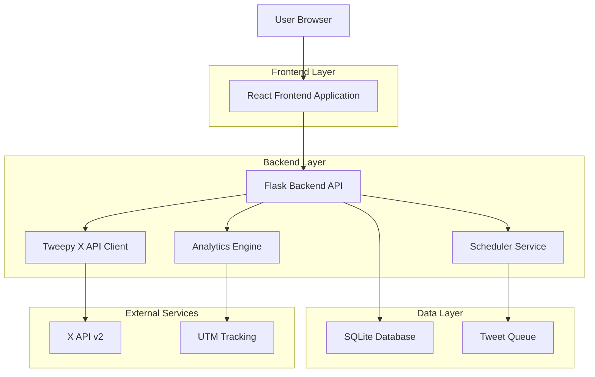
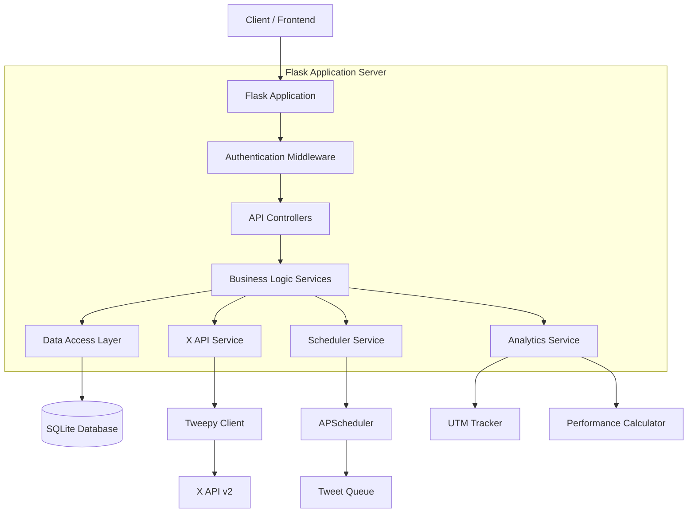
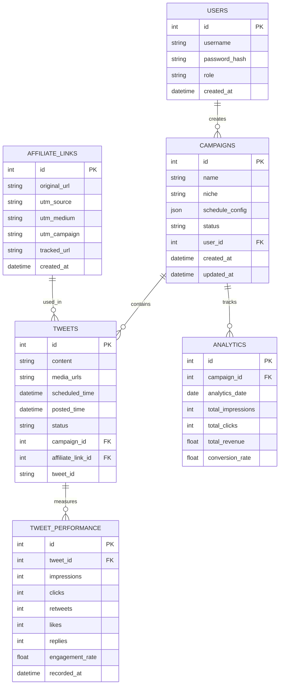

# X Affiliate Marketing Automation Platform - Technical Architecture Document

## 1. Architecture Design



## 2. Technology Description

- **Frontend**: React@18 + tailwindcss@3 + vite + axios
- **Backend**: Flask@2.3 + Tweepy@4.14 + SQLAlchemy@2.0 + APScheduler@3.10
- **Database**: SQLite (MVP) / PostgreSQL (Production)
- **Containerization**: Docker + Docker Compose
- **Scheduling**: APScheduler with persistent job store
- **Authentication**: X OAuth 2.0 + JWT for session management

## 3. Route Definitions

| Route | Purpose |
|-------|---------|
| / | Dashboard home page with campaign overview and metrics |
| /campaigns | Campaign management interface for creating and editing campaigns |
| /content | Content library for managing tweets, templates, and media |
| /analytics | Analytics dashboard with performance metrics and A/B testing results |
| /settings | System configuration including X API setup and automation rules |
| /login | Authentication page for system access |

## 4. API Definitions

### 4.1 Core API

**Authentication**
```
POST /api/auth/login
```

Request:
| Param Name | Param Type | isRequired | Description |
|------------|------------|------------|-------------|
| username | string | true | Admin username |
| password | string | true | Admin password |

Response:
| Param Name | Param Type | Description |
|------------|------------|-------------|
| token | string | JWT authentication token |
| expires_in | integer | Token expiration time in seconds |

**Campaign Management**
```
POST /api/campaigns
```

Request:
| Param Name | Param Type | isRequired | Description |
|------------|------------|------------|-------------|
| name | string | true | Campaign name |
| niche | string | true | Target niche (milf, teen, trans, etc.) |
| schedule | object | true | Posting schedule configuration |
| tweets | array | true | Array of tweet templates |

Response:
| Param Name | Param Type | Description |
|------------|------------|-------------|
| campaign_id | string | Unique campaign identifier |
| status | string | Campaign creation status |

**Tweet Posting**
```
POST /api/tweets/schedule
```

Request:
| Param Name | Param Type | isRequired | Description |
|------------|------------|------------|-------------|
| campaign_id | string | true | Associated campaign ID |
| content | string | true | Tweet text content |
| media_urls | array | false | Attached media file URLs |
| scheduled_time | datetime | true | When to post the tweet |
| affiliate_link | string | true | Affiliate URL with UTM parameters |

**Analytics**
```
GET /api/analytics/performance
```

Query Parameters:
| Param Name | Param Type | isRequired | Description |
|------------|------------|------------|-------------|
| campaign_id | string | false | Filter by specific campaign |
| date_range | string | false | Date range (7d, 30d, 90d) |
| niche | string | false | Filter by content niche |

Response:
| Param Name | Param Type | Description |
|------------|------------|-------------|
| impressions | integer | Total tweet impressions |
| clicks | integer | Total affiliate link clicks |
| engagement_rate | float | Overall engagement percentage |
| revenue | float | Estimated affiliate revenue |

**X API Integration**
```
POST /api/x/authenticate
```

Request:
| Param Name | Param Type | isRequired | Description |
|------------|------------|------------|-------------|
| api_key | string | true | X API key |
| api_secret | string | true | X API secret |
| access_token | string | true | X access token |
| access_token_secret | string | true | X access token secret |

Example Request:
```json
{
  "name": "MILF Campaign Q1",
  "niche": "milf",
  "schedule": {
    "frequency": "daily",
    "times": ["09:00", "15:00", "21:00"]
  },
  "tweets": [
    {
      "content": "🔥 MILF heaven! Check out the hottest content. #MILF #Mature #AdultContent",
      "affiliate_link": "https://example.com/affiliate?ref=123"
    }
  ]
}
```

## 5. Server Architecture Diagram



## 6. Data Model

### 6.1 Data Model Definition



### 6.2 Data Definition Language

**Users Table**
```sql
CREATE TABLE users (
    id INTEGER PRIMARY KEY AUTOINCREMENT,
    username VARCHAR(50) UNIQUE NOT NULL,
    password_hash VARCHAR(255) NOT NULL,
    role VARCHAR(20) DEFAULT 'admin' CHECK (role IN ('admin', 'content_manager')),
    created_at TIMESTAMP DEFAULT CURRENT_TIMESTAMP
);

-- Initial admin user
INSERT INTO users (username, password_hash, role) 
VALUES ('admin', 'pbkdf2:sha256:260000$...', 'admin');
```

**Campaigns Table**
```sql
CREATE TABLE campaigns (
    id INTEGER PRIMARY KEY AUTOINCREMENT,
    name VARCHAR(100) NOT NULL,
    niche VARCHAR(50) NOT NULL CHECK (niche IN ('milf', 'teen', 'trans', 'breeding', 'creampie', 'femboy', 'gay', 'bisexual')),
    schedule_config TEXT NOT NULL, -- JSON string
    status VARCHAR(20) DEFAULT 'active' CHECK (status IN ('active', 'paused', 'completed')),
    user_id INTEGER NOT NULL,
    created_at TIMESTAMP DEFAULT CURRENT_TIMESTAMP,
    updated_at TIMESTAMP DEFAULT CURRENT_TIMESTAMP,
    FOREIGN KEY (user_id) REFERENCES users(id)
);

CREATE INDEX idx_campaigns_niche ON campaigns(niche);
CREATE INDEX idx_campaigns_status ON campaigns(status);
```

**Affiliate Links Table**
```sql
CREATE TABLE affiliate_links (
    id INTEGER PRIMARY KEY AUTOINCREMENT,
    original_url TEXT NOT NULL,
    utm_source VARCHAR(50) DEFAULT 'x_ads',
    utm_medium VARCHAR(50) DEFAULT 'social',
    utm_campaign VARCHAR(100),
    tracked_url TEXT NOT NULL,
    created_at TIMESTAMP DEFAULT CURRENT_TIMESTAMP
);

CREATE INDEX idx_affiliate_links_campaign ON affiliate_links(utm_campaign);
```

**Tweets Table**
```sql
CREATE TABLE tweets (
    id INTEGER PRIMARY KEY AUTOINCREMENT,
    content TEXT NOT NULL,
    media_urls TEXT, -- JSON array of media URLs
    scheduled_time TIMESTAMP NOT NULL,
    posted_time TIMESTAMP,
    status VARCHAR(20) DEFAULT 'scheduled' CHECK (status IN ('scheduled', 'posted', 'failed', 'cancelled')),
    campaign_id INTEGER NOT NULL,
    affiliate_link_id INTEGER,
    tweet_id VARCHAR(50), -- X tweet ID after posting
    FOREIGN KEY (campaign_id) REFERENCES campaigns(id),
    FOREIGN KEY (affiliate_link_id) REFERENCES affiliate_links(id)
);

CREATE INDEX idx_tweets_scheduled_time ON tweets(scheduled_time);
CREATE INDEX idx_tweets_status ON tweets(status);
CREATE INDEX idx_tweets_campaign ON tweets(campaign_id);
```

**Tweet Performance Table**
```sql
CREATE TABLE tweet_performance (
    id INTEGER PRIMARY KEY AUTOINCREMENT,
    tweet_id INTEGER NOT NULL,
    impressions INTEGER DEFAULT 0,
    clicks INTEGER DEFAULT 0,
    retweets INTEGER DEFAULT 0,
    likes INTEGER DEFAULT 0,
    replies INTEGER DEFAULT 0,
    engagement_rate REAL DEFAULT 0.0,
    recorded_at TIMESTAMP DEFAULT CURRENT_TIMESTAMP,
    FOREIGN KEY (tweet_id) REFERENCES tweets(id)
);

CREATE INDEX idx_performance_tweet ON tweet_performance(tweet_id);
CREATE INDEX idx_performance_recorded ON tweet_performance(recorded_at);
```

**Analytics Table**
```sql
CREATE TABLE analytics (
    id INTEGER PRIMARY KEY AUTOINCREMENT,
    campaign_id INTEGER NOT NULL,
    analytics_date DATE NOT NULL,
    total_impressions INTEGER DEFAULT 0,
    total_clicks INTEGER DEFAULT 0,
    total_revenue REAL DEFAULT 0.0,
    conversion_rate REAL DEFAULT 0.0,
    FOREIGN KEY (campaign_id) REFERENCES campaigns(id),
    UNIQUE(campaign_id, analytics_date)
);

CREATE INDEX idx_analytics_campaign_date ON analytics(campaign_id, analytics_date);
```

**Initial Data**
```sql
-- Sample affiliate links for different niches
INSERT INTO affiliate_links (original_url, utm_campaign, tracked_url) VALUES
('https://example-adult-site.com/milf', 'milf_campaign', 'https://example-adult-site.com/milf?utm_source=x_ads&utm_medium=social&utm_campaign=milf_campaign'),
('https://example-adult-site.com/teen', 'teen_campaign', 'https://example-adult-site.com/teen?utm_source=x_ads&utm_medium=social&utm_campaign=teen_campaign'),
('https://example-adult-site.com/trans', 'trans_campaign', 'https://example-adult-site.com/trans?utm_source=x_ads&utm_medium=social&utm_campaign=trans_campaign');

-- Sample campaign
INSERT INTO campaigns (name, niche, schedule_config, user_id) VALUES
('MILF Content Q1 2025', 'milf', '{"frequency": "daily", "times": ["09:00", "15:00", "21:00"]}', 1);
```