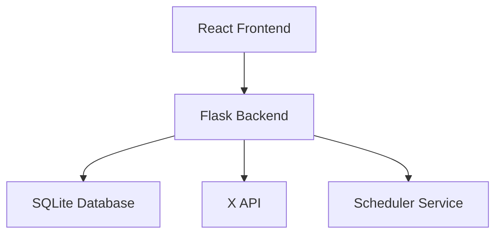
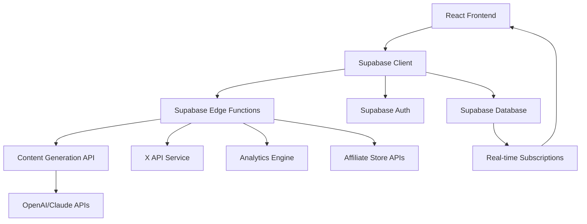

# X Affiliate Marketing Platform - Phase 2 Implementation Plan

## 1. Executive Summary

This implementation plan outlines the next phase of development for the X Affiliate Marketing Automation Platform, focusing on advanced content generation capabilities, Supabase backend migration, enhanced analytics, and automated workflows. The plan transitions from the current Flask-based MVP to a scalable, AI-powered platform leveraging modern cloud infrastructure.

**Key Objectives:**
- Implement AI-driven content generation for automated tweet creation
- Migrate from Flask/SQLite to Supabase for enhanced scalability
- Establish robust development environment with GPU acceleration
- Expand functionality beyond manual posting to full automation
- Create comprehensive testing and deployment procedures

## 2. Phase 2 Requirements Analysis

### 2.1 Affiliate Store Content Generation Integration

**Current State:** Manual tweet creation using templates
**Target State:** AI-powered automated content generation with affiliate store integration

**Requirements:**
- Automated content generation using LLM APIs (OpenAI GPT-4, Claude)
- Integration with affiliate store APIs for product data
- Dynamic content personalization based on niche and performance
- Content compliance checking for X platform policies
- A/B testing automation for content optimization

### 2.2 Supabase Backend Development

**Current State:** Flask backend with SQLite database
**Target State:** Supabase-powered backend with PostgreSQL and real-time features

**Migration Requirements:**
- Database schema migration from SQLite to PostgreSQL
- Authentication system migration to Supabase Auth
- Real-time subscriptions for live analytics
- Edge functions for serverless processing
- Row Level Security (RLS) implementation

### 2.3 Development Environment Enhancement

**Current State:** Local development with basic tooling
**Target State:** Optimized development environment with GPU acceleration

**Requirements:**
- Trae IDE configuration and optimization
- Thunder Compute GPU instance setup for AI workloads
- Development workflow automation
- Environment containerization and reproducibility

### 2.4 Enhanced Functionality

**Current State:** Manual Twitter posting interface
**Target State:** Comprehensive automation and analytics platform

**Requirements:**
- Advanced analytics with predictive insights
- Automated posting workflows with intelligent scheduling
- Multi-platform support (X, Instagram, TikTok)
- Revenue optimization algorithms
- Compliance monitoring and automated content moderation

## 3. Technical Architecture Evolution

### 3.1 Current Architecture (Phase 1)


### 3.2 Target Architecture (Phase 2)


## 4. Implementation Roadmap

### 4.1 Phase 2A: Foundation Setup (Weeks 1-2)

**Week 1: Development Environment**
- [ ] Configure Trae IDE with project-specific settings
- [ ] Set up Thunder Compute GPU instance
- [ ] Install and configure development dependencies
- [ ] Create development workflow automation scripts
- [ ] Document environment setup procedures

**Week 2: Supabase Infrastructure**
- [ ] Create Supabase project and configure settings
- [ ] Design and implement PostgreSQL schema migration
- [ ] Set up Supabase Auth with custom user roles
- [ ] Configure Row Level Security policies
- [ ] Implement basic Edge Functions structure

### 4.2 Phase 2B: Content Generation Integration (Weeks 3-5)

**Week 3: AI Content Generation Foundation**
- [ ] Integrate OpenAI GPT-4 API for content generation
- [ ] Implement content generation prompts for each niche
- [ ] Create content quality scoring system
- [ ] Develop content compliance checking
- [ ] Build content variation generation for A/B testing

**Week 4: Affiliate Store Integration**
- [ ] Research and integrate major affiliate store APIs
- [ ] Implement product data synchronization
- [ ] Create dynamic content templates with product data
- [ ] Develop affiliate link optimization algorithms
- [ ] Build product performance tracking

**Week 5: Content Automation Pipeline**
- [ ] Implement automated content generation workflows
- [ ] Create content scheduling optimization
- [ ] Build content performance feedback loops
- [ ] Develop content personalization algorithms
- [ ] Implement batch content generation

### 4.3 Phase 2C: Enhanced Analytics & Automation (Weeks 6-8)

**Week 6: Advanced Analytics**
- [ ] Implement real-time analytics with Supabase subscriptions
- [ ] Create predictive performance models
- [ ] Build revenue optimization algorithms
- [ ] Develop competitor analysis features
- [ ] Implement advanced reporting dashboards

**Week 7: Automated Workflows**
- [ ] Create intelligent posting schedule optimization
- [ ] Implement automated A/B testing workflows
- [ ] Build performance-based content adjustment
- [ ] Develop automated campaign optimization
- [ ] Create alert and notification systems

**Week 8: Multi-Platform Expansion**
- [ ] Research Instagram and TikTok APIs
- [ ] Implement multi-platform posting capabilities
- [ ] Create platform-specific content adaptation
- [ ] Build cross-platform analytics
- [ ] Develop unified campaign management

### 4.4 Phase 2D: Testing & Deployment (Weeks 9-10)

**Week 9: Comprehensive Testing**
- [ ] Implement unit tests for all new features
- [ ] Create integration tests for API endpoints
- [ ] Develop end-to-end testing scenarios
- [ ] Perform load testing with simulated traffic
- [ ] Conduct security testing and vulnerability assessment

**Week 10: Production Deployment**
- [ ] Set up production Supabase environment
- [ ] Configure CI/CD pipelines
- [ ] Implement monitoring and logging
- [ ] Create backup and disaster recovery procedures
- [ ] Perform production deployment and validation

## 5. Detailed Implementation Specifications

### 5.1 Supabase Setup Instructions

**Step 1: Project Creation**
1. Navigate to [Supabase Dashboard](https://supabase.com/dashboard)
2. Create new project: "x-affiliate-marketing-prod"
3. Select region closest to target users
4. Configure project settings:
   - Database password: Generate secure password
   - Pricing plan: Pro (for production features)

**Step 2: Database Schema Migration**
```sql
-- Enable necessary extensions
CREATE EXTENSION IF NOT EXISTS "uuid-ossp";
CREATE EXTENSION IF NOT EXISTS "pg_cron";

-- Users table (extends Supabase auth.users)
CREATE TABLE public.user_profiles (
    id UUID REFERENCES auth.users(id) PRIMARY KEY,
    username VARCHAR(50) UNIQUE NOT NULL,
    role VARCHAR(20) DEFAULT 'user' CHECK (role IN ('admin', 'user', 'content_manager')),
    plan VARCHAR(20) DEFAULT 'free' CHECK (plan IN ('free', 'premium', 'enterprise')),
    usage_count INTEGER DEFAULT 0,
    created_at TIMESTAMP WITH TIME ZONE DEFAULT NOW(),
    updated_at TIMESTAMP WITH TIME ZONE DEFAULT NOW()
);

-- Campaigns table
CREATE TABLE public.campaigns (
    id UUID PRIMARY KEY DEFAULT uuid_generate_v4(),
    name VARCHAR(100) NOT NULL,
    niche VARCHAR(50) NOT NULL,
    schedule_config JSONB NOT NULL,
    status VARCHAR(20) DEFAULT 'active',
    user_id UUID REFERENCES public.user_profiles(id),
    ai_settings JSONB DEFAULT '{}',
    created_at TIMESTAMP WITH TIME ZONE DEFAULT NOW(),
    updated_at TIMESTAMP WITH TIME ZONE DEFAULT NOW()
);

-- Content generation templates
CREATE TABLE public.content_templates (
    id UUID PRIMARY KEY DEFAULT uuid_generate_v4(),
    name VARCHAR(100) NOT NULL,
    niche VARCHAR(50) NOT NULL,
    template_text TEXT NOT NULL,
    ai_prompt TEXT,
    variables JSONB DEFAULT '[]',
    performance_score DECIMAL(3,2) DEFAULT 0.0,
    created_at TIMESTAMP WITH TIME ZONE DEFAULT NOW()
);

-- Generated content tracking
CREATE TABLE public.generated_content (
    id UUID PRIMARY KEY DEFAULT uuid_generate_v4(),
    campaign_id UUID REFERENCES public.campaigns(id),
    template_id UUID REFERENCES public.content_templates(id),
    content TEXT NOT NULL,
    ai_model VARCHAR(50),
    generation_params JSONB,
    quality_score DECIMAL(3,2),
    status VARCHAR(20) DEFAULT 'pending',
    created_at TIMESTAMP WITH TIME ZONE DEFAULT NOW()
);
```

**Step 3: Row Level Security Setup**
```sql
-- Enable RLS
ALTER TABLE public.user_profiles ENABLE ROW LEVEL SECURITY;
ALTER TABLE public.campaigns ENABLE ROW LEVEL SECURITY;
ALTER TABLE public.content_templates ENABLE ROW LEVEL SECURITY;
ALTER TABLE public.generated_content ENABLE ROW LEVEL SECURITY;

-- RLS Policies
CREATE POLICY "Users can view own profile" ON public.user_profiles
    FOR SELECT USING (auth.uid() = id);

CREATE POLICY "Users can update own profile" ON public.user_profiles
    FOR UPDATE USING (auth.uid() = id);

CREATE POLICY "Users can view own campaigns" ON public.campaigns
    FOR SELECT USING (auth.uid() = user_id);

CREATE POLICY "Users can manage own campaigns" ON public.campaigns
    FOR ALL USING (auth.uid() = user_id);
```

**Step 4: Edge Functions Setup**
```typescript
// supabase/functions/generate-content/index.ts
import { serve } from "https://deno.land/std@0.168.0/http/server.ts"
import { createClient } from 'https://esm.sh/@supabase/supabase-js@2'

serve(async (req) => {
  const { campaign_id, template_id, variables } = await req.json()
  
  // Initialize Supabase client
  const supabase = createClient(
    Deno.env.get('SUPABASE_URL') ?? '',
    Deno.env.get('SUPABASE_SERVICE_ROLE_KEY') ?? ''
  )
  
  // Generate content using AI
  const generatedContent = await generateWithAI(template_id, variables)
  
  // Store generated content
  const { data, error } = await supabase
    .from('generated_content')
    .insert({
      campaign_id,
      template_id,
      content: generatedContent,
      ai_model: 'gpt-4',
      quality_score: await calculateQualityScore(generatedContent)
    })
  
  return new Response(JSON.stringify({ data, error }), {
    headers: { 'Content-Type': 'application/json' }
  })
})
```

### 5.2 Development Environment Configuration

**Trae IDE Setup**
```json
// .trae/config.json
{
  "environment": {
    "node_version": "18.17.0",
    "python_version": "3.11.0",
    "gpu_enabled": true,
    "extensions": [
      "ms-python.python",
      "bradlc.vscode-tailwindcss",
      "ms-vscode.vscode-typescript-next",
      "supabase.supabase"
    ]
  },
  "development": {
    "auto_save": true,
    "hot_reload": true,
    "debug_mode": true
  },
  "ai_integration": {
    "openai_api_key": "${OPENAI_API_KEY}",
    "claude_api_key": "${CLAUDE_API_KEY}",
    "gpu_acceleration": true
  }
}
```

**Thunder Compute GPU Configuration**
```yaml
# docker-compose.gpu.yml
version: '3.8'
services:
  ai-content-generator:
    build:
      context: .
      dockerfile: Dockerfile.gpu
    runtime: nvidia
    environment:
      - NVIDIA_VISIBLE_DEVICES=all
      - OPENAI_API_KEY=${OPENAI_API_KEY}
      - CLAUDE_API_KEY=${CLAUDE_API_KEY}
    volumes:
      - ./ai-models:/app/models
    ports:
      - "8000:8000"
```

### 5.3 Content Generation Implementation

**AI Content Generation Service**
```python
# services/content_generator.py
import openai
import anthropic
from typing import Dict, List, Optional

class ContentGenerator:
    def __init__(self):
        self.openai_client = openai.OpenAI()
        self.claude_client = anthropic.Anthropic()
    
    async def generate_tweet_content(
        self, 
        niche: str, 
        template: str, 
        variables: Dict,
        model: str = "gpt-4"
    ) -> str:
        prompt = self._build_prompt(niche, template, variables)
        
        if model.startswith("gpt"):
            return await self._generate_with_openai(prompt, model)
        elif model.startswith("claude"):
            return await self._generate_with_claude(prompt, model)
    
    def _build_prompt(self, niche: str, template: str, variables: Dict) -> str:
        base_prompt = f"""
        Generate engaging Twitter content for {niche} niche.
        Template: {template}
        Variables: {variables}
        
        Requirements:
        - Keep under 280 characters
        - Include relevant hashtags
        - Maintain brand voice
        - Ensure compliance with platform policies
        - Optimize for engagement
        """
        return base_prompt
    
    async def _generate_with_openai(self, prompt: str, model: str) -> str:
        response = await self.openai_client.chat.completions.create(
            model=model,
            messages=[{"role": "user", "content": prompt}],
            max_tokens=100,
            temperature=0.7
        )
        return response.choices[0].message.content
```

## 6. Resource Requirements

### 6.1 Development Resources

**Human Resources:**
- 1 Full-stack Developer (React/TypeScript/Python)
- 1 AI/ML Engineer (Content Generation)
- 1 DevOps Engineer (Infrastructure)
- 1 QA Engineer (Testing)

**Infrastructure Resources:**
- Thunder Compute GPU Instance (A100 40GB)
- Supabase Pro Plan ($25/month)
- OpenAI API Credits ($500/month estimated)
- Claude API Credits ($300/month estimated)
- Domain and SSL certificates

**Development Tools:**
- Trae IDE Pro License
- GitHub Pro for private repositories
- Monitoring tools (DataDog/New Relic)
- Testing frameworks and tools

### 6.2 Technical Dependencies

**Frontend Dependencies:**
```json
{
  "@supabase/supabase-js": "^2.38.0",
  "@tanstack/react-query": "^5.0.0",
  "recharts": "^2.8.0",
  "framer-motion": "^10.16.0",
  "react-hook-form": "^7.47.0"
}
```

**Backend Dependencies:**
```json
{
  "openai": "^1.3.0",
  "anthropic": "^0.7.0",
  "supabase": "^1.110.0",
  "tweepy": "^4.14.0",
  "celery": "^5.3.0",
  "redis": "^5.0.0"
}
```

## 7. Testing Strategy

### 7.1 Testing Framework

**Unit Testing:**
- Frontend: Jest + React Testing Library
- Backend: pytest + pytest-asyncio
- Coverage target: 90%+

**Integration Testing:**
- API endpoint testing with Supabase
- AI content generation pipeline testing
- Social media API integration testing

**End-to-End Testing:**
- Playwright for browser automation
- Campaign creation to posting workflow
- Analytics data flow validation

### 7.2 Performance Testing

**Load Testing:**
- Concurrent user simulation (100+ users)
- Content generation throughput testing
- Database performance under load
- API rate limiting validation

**Stress Testing:**
- Peak traffic simulation
- Resource exhaustion scenarios
- Recovery time measurement
- Failover testing

## 8. Deployment Strategy

### 8.1 CI/CD Pipeline

```yaml
# .github/workflows/deploy.yml
name: Deploy to Production

on:
  push:
    branches: [main]

jobs:
  test:
    runs-on: ubuntu-latest
    steps:
      - uses: actions/checkout@v3
      - name: Run tests
        run: |
          npm test
          pytest
  
  deploy:
    needs: test
    runs-on: ubuntu-latest
    steps:
      - name: Deploy to Supabase
        run: |
          supabase db push
          supabase functions deploy
      - name: Deploy Frontend
        run: |
          npm run build
          vercel deploy --prod
```

### 8.2 Monitoring and Alerting

**Application Monitoring:**
- Supabase Dashboard for database metrics
- Vercel Analytics for frontend performance
- Custom dashboards for business metrics

**Alert Configuration:**
- API error rate > 5%
- Content generation failures
- Database connection issues
- Revenue tracking anomalies

## 9. Risk Management

### 9.1 Technical Risks

| Risk | Impact | Probability | Mitigation |
|------|--------|-------------|------------|
| AI API Rate Limits | High | Medium | Implement caching, multiple providers |
| Supabase Migration Issues | High | Low | Thorough testing, rollback plan |
| Content Compliance Violations | High | Medium | Automated content filtering |
| Performance Degradation | Medium | Medium | Load testing, monitoring |

### 9.2 Business Risks

| Risk | Impact | Probability | Mitigation |
|------|--------|-------------|------------|
| Platform Policy Changes | High | Medium | Multi-platform strategy |
| Affiliate Program Changes | Medium | High | Diversified affiliate portfolio |
| Competition | Medium | High | Unique AI features, better UX |
| Market Saturation | Low | Low | Continuous innovation |

## 10. Success Metrics

### 10.1 Technical KPIs
- System uptime: 99.9%
- API response time: <200ms
- Content generation speed: <5 seconds
- Database query performance: <100ms

### 10.2 Business KPIs
- User engagement increase: 50%
- Content generation efficiency: 80% reduction in manual work
- Revenue per campaign: 25% increase
- Customer satisfaction: 4.5/5 rating

## 11. Timeline Summary

**Phase 2A (Weeks 1-2): Foundation**
- Development environment setup
- Supabase infrastructure

**Phase 2B (Weeks 3-5): Core Features**
- AI content generation
- Affiliate store integration
- Automation pipeline

**Phase 2C (Weeks 6-8): Enhancement**
- Advanced analytics
- Automated workflows
- Multi-platform support

**Phase 2D (Weeks 9-10): Launch**
- Testing and validation
- Production deployment

**Total Duration: 10 weeks**
**Go-Live Date: Target Q2 2025**

## 12. Next Steps

### Immediate Actions (Week 1)
1. **Environment Setup**
   - Configure Trae IDE with project settings
   - Provision Thunder Compute GPU instance
   - Set up development workspace

2. **Team Preparation**
   - Assign team roles and responsibilities
   - Schedule weekly sprint planning meetings
   - Set up communication channels

3. **Infrastructure Planning**
   - Create Supabase project
   - Plan database migration strategy
   - Design API architecture

### Long-term Milestones
- **Month 1**: Complete foundation and core features
- **Month 2**: Implement enhanced functionality
- **Month 3**: Testing, optimization, and launch
- **Month 4+**: Post-launch optimization and feature expansion

This implementation plan provides a comprehensive roadmap for transforming the X Affiliate Marketing platform into a next-generation AI-powered automation system. The phased approach ensures manageable development cycles while delivering incremental value to users.